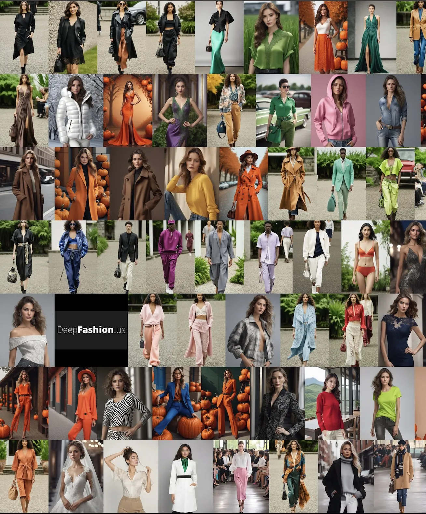

# Welcome to DeepFashion

[DeepFashion](https://deepfashion.us) is an :robot_face: AI which generates visual imagery and creative inspiration in brand DNA by training previous collections into a brand AI Model. No code required. 

{.callout}
> “Create 100X looks in brand DNA with AI."

DeepFashion helps turn 5 Looks into millions in brand DNA style, which takes only a few minitues. Training takes around 10~20 minutues, and images generation takes around 10 seconds.  :+1:

---

## Quick start :zap:

1. Upload 5 of your lookbooks images in [Dashboard](http://deepfashion.us/dashboard)
2. Train your brand AI model by clicks in 10 minutes 
3. Get the new lookbooks in [universal prompt](/guides/universalprompt/). 

[!embed text="DeepFashion Training Brand Style AI"](https://www.youtube.com/embed/EDOUW8STwDM)

---

## Features

### :dna:  Brand AI models training

Deepfashion train your brand style AI model from 5 of your looks in just clicks. 

### :dress: Looks generation in brand style

Generate looks with everyday lanauges, with the help of [universal prompt](/guides/universalprompt/) in text to image, image to image method.

### :gem: 4K Resolution output

High resolution output for your looks.

### :speaking_head_in_silhouette: Universal prompt

[universal prompt](/guides/universalprompt/) allows users use everyday language to create looks with the help from AI in any lanauges. 

### :memo: AI prompt asistants

Explore a diverse selection of styles and colors with our complimentary AI prompt, designed to assist you in crafting a one-of-a-kind look. Whether you prefer to utilize the look style in our Studio or harness the power of Stable Diffusion, we've got you covered.

### :shopping_bags: Fashion Stylist

Get the stylist advices based on your created looks with AI

### :film_frames: Live Looks

Make the look live. 

### :robot_face: Face Swap

Swap to your model's face

### :woman-gesturing-ok: No watermark

There is no watermark on the generated images.

### :man-gesturing-ok: Commercial usage license

You can use it for commercial purpose.

### :female-artist: Image to sketch

Convert the looks into sketch for tech packs. 

---

## Support

Do you have a question, or would like to make a feature request?

Do you have a general inquiry? Please feel free to contact us at support@deepfashion.us.

We :heart: feedback.

----

